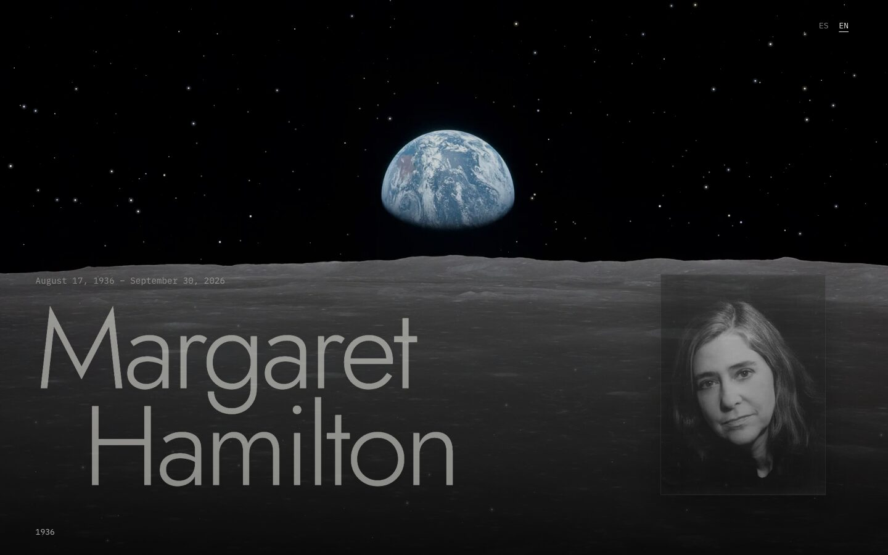
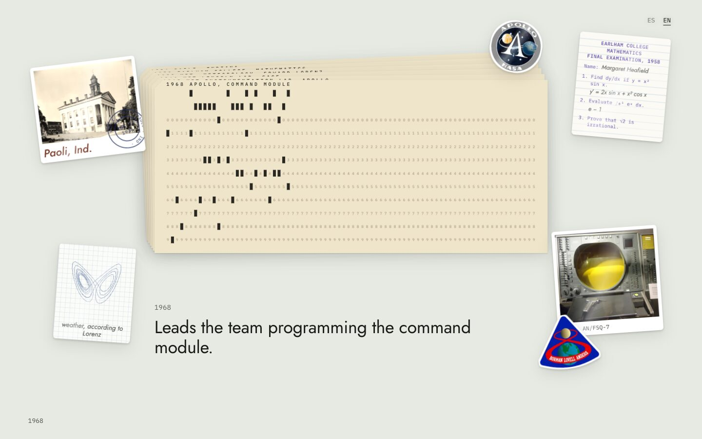
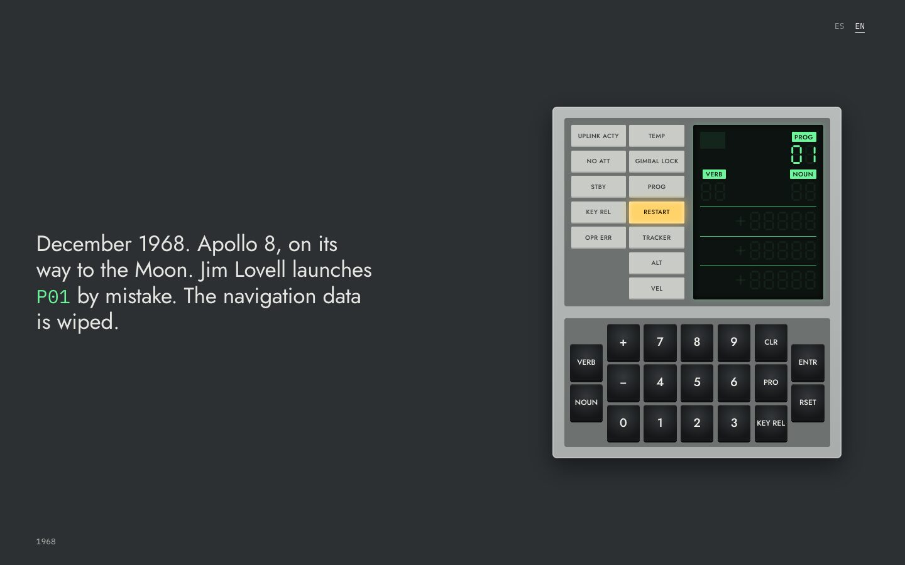
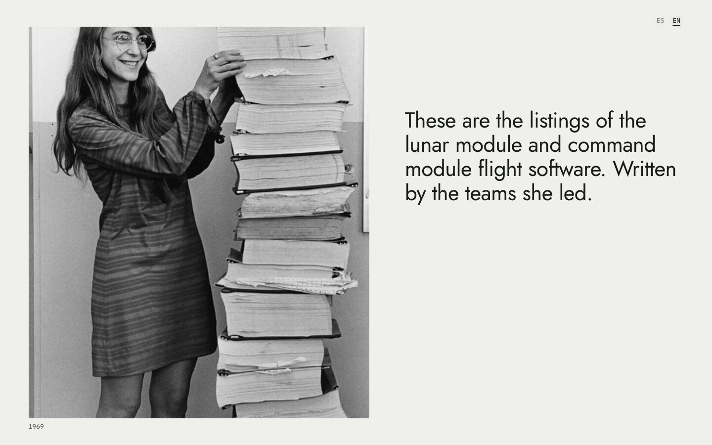
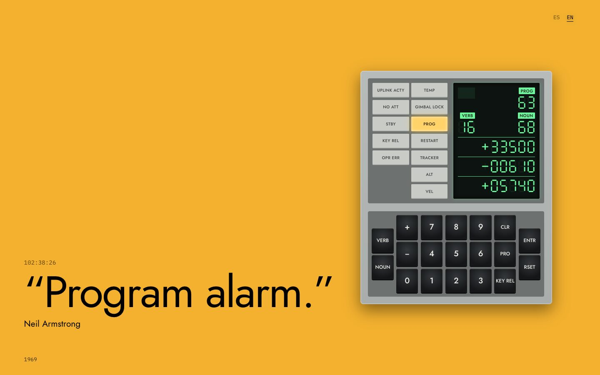
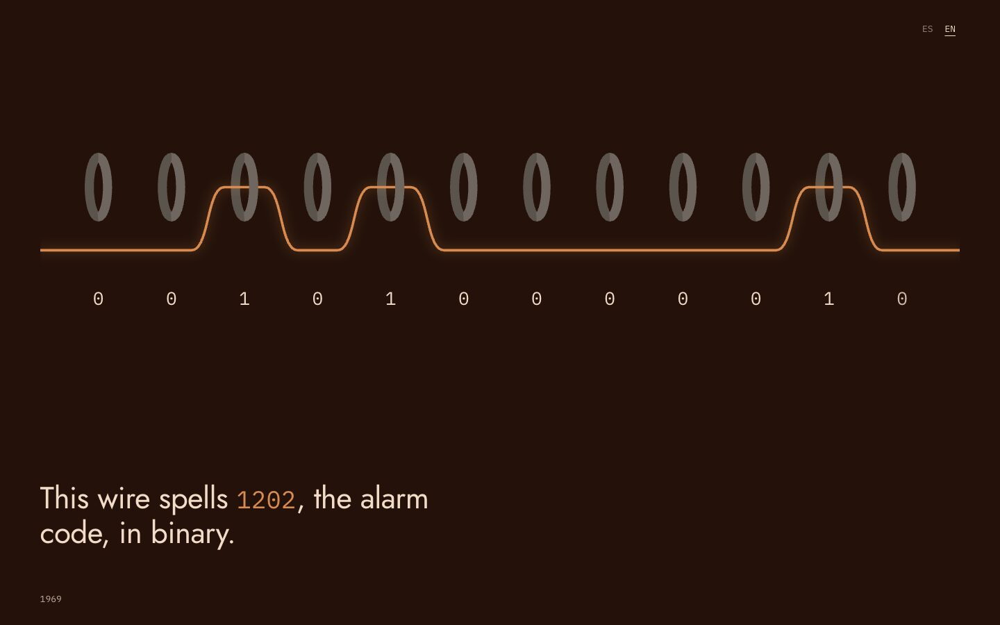
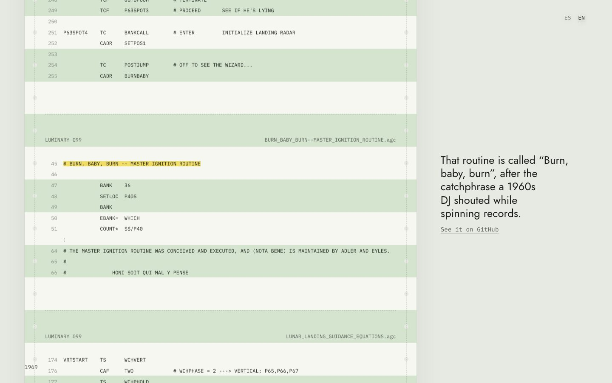
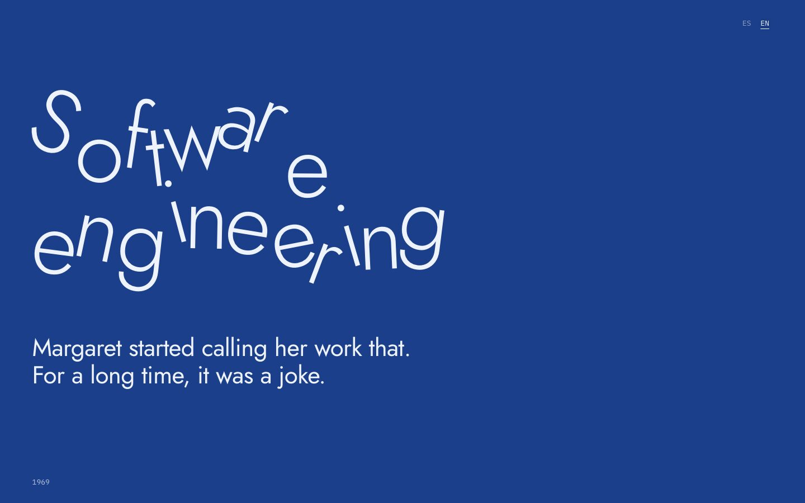
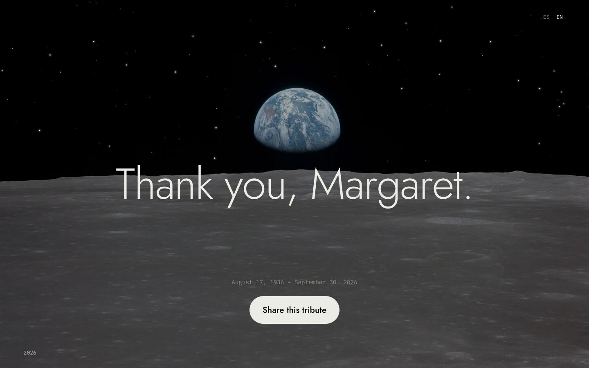

<div align="center">

# margarethamilton.dev

**A scroll-driven tribute to Margaret Hamilton (1936–2026)**, who led the Apollo 11 flight software and gave software engineering its name.

[**Visit the site →**](https://margarethamilton.dev/en/) · [Español](https://margarethamilton.dev/) · [English](https://margarethamilton.dev/en/)



</div>

## About

> “There was no choice but to be pioneers. No time to be beginners.”
> — Margaret Hamilton

This site tells her story as one continuous scroll, from Paoli, Indiana, in 1936 to the Presidential Medal of Freedom in 2016. Every chapter is a full-screen scene animated by the scroll: punch cards, a working DSKY, the tower of printed listings, the 1202 alarm, hand-woven rope memory and the real Apollo 11 source code.

## Scenes

| #   | Scene                    | What happens                                                                                                                                                                                                  |
| :-- | :----------------------- | :------------------------------------------------------------------------------------------------------------------------------------------------------------------------------------------------------------ |
| 1   | **Opening**              | Stars over the Earthrise fly into place and become the letters of her quote.                                                                                                                                  |
| 2   | **Milestones**           | Her early years (Earlham, Edward Lorenz, SAGE, Apollo) punched as real Hollerith code on 80-column cards, like the ones used at MIT.                                                                           |
| 3   | **Lauren**               | A working DSKY replays the story of her daughter crashing the simulator with P01, the mistake Jim Lovell repeated on Apollo 8, and the birth of defensive programming.                                         |
| 4   | **The tower**            | The famous 1969 photo next to the listings, stacked binder by binder with real Luminary 099 and Comanche 055 module names.                                                                                     |
| 5   | **The 1202 alarm**       | The Apollo 11 descent: the program alarms on the DSKY, “We’re Go on that alarm” and “The Eagle has landed.”                                                                                                    |
| 6   | **Rope memory**          | A wire threads through magnetic cores to spell `1202` in binary: software that was literally woven by hand.                                                                                                   |
| 7   | **The code**             | Real excerpts from Luminary 099 (`BURN_BABY_BURN`, `PINBALL_GAME_BUTTONS_AND_LIGHTS`, “PLEASE CRANK THE SILLY THING AROUND”) linked to their exact lines on GitHub, ending with her signature in the README. |
| 8   | **Software engineering** | The two words wobble like the joke they once were, then straighten and gain weight as you scroll, until they name a profession.                                                                                |
| 9   | **Legacy**               | Higher Order Software, Hamilton Technologies, the NASA Exceptional Space Act Award and the Presidential Medal of Freedom.                                                                                      |
| 10  | **Closing**              | “Thank you, Margaret.”                                                                                                                                                                                        |

## Screenshots

<table>
  <tr>
    <td width="50%"></td>
    <td width="50%"></td>
  </tr>
  <tr>
    <td align="center"><sub>Milestones on 80-column punch cards</sub></td>
    <td align="center"><sub>A working DSKY and the P01 incident</sub></td>
  </tr>
  <tr>
    <td></td>
    <td></td>
  </tr>
  <tr>
    <td align="center"><sub>MIT, 1969: the tower of listings</sub></td>
    <td align="center"><sub>“Program alarm.”</sub></td>
  </tr>
  <tr>
    <td></td>
    <td></td>
  </tr>
  <tr>
    <td align="center"><sub>Rope memory spelling <code>1202</code></sub></td>
    <td align="center"><sub>The real Apollo 11 source code</sub></td>
  </tr>
  <tr>
    <td></td>
    <td></td>
  </tr>
  <tr>
    <td align="center"><sub>“Software engineering”, once a joke</sub></td>
    <td align="center"><sub>Thank you, Margaret.</sub></td>
  </tr>
</table>

## Under the hood

- **[Astro](https://astro.build) with zero UI frameworks.** The site is fully static: Astro components, scoped CSS and a few small TypeScript modules.
- **Scroll-driven scenes.** Each `[data-scene]` is a tall container with a sticky stage. [`src/scripts/scroll.ts`](src/scripts/scroll.ts) computes its progress (0 → 1) and exposes it as the `--p` custom property, so most animations are plain CSS. Texts appear at their moment through `data-beat`, and the page theme and year indicator follow the active scene.
- **Stars that become letters.** [`src/scripts/stars.ts`](src/scripts/stars.ts) scatters candidate stars across the sky of the photo and pairs each glyph with a star using an optimal assignment, so the trajectories never cross.
- **A DSKY in HTML and CSS.** [`Dsky.astro`](src/components/Dsky.astro) and [`src/scripts/dsky.ts`](src/scripts/dsky.ts) recreate the Apollo Guidance Computer display and keyboard, with segmented electroluminescent digits.
- **The real source code.** [`src/data/listing.ts`](src/data/listing.ts) holds verbatim fragments of Luminary 099, the lunar module software, with their original line numbers. The GitHub star count of [chrislgarry/Apollo-11](https://github.com/chrislgarry/Apollo-11) is fetched at build time.
- **Bilingual.** Spanish (default, `/`) and English (`/en/`) with Astro’s i18n routing and a tiny `t({ es, en })` helper. The first visit follows the browser language and the choice is remembered.
- **Typography with a story.** [Jost](https://fonts.google.com/specimen/Jost), a revival of Futura, the typeface on the plaque Apollo 11 left on the Moon, paired with IBM Plex Mono. Both are self-hosted through the Astro Fonts API.
- **Details.** Responsive images optimized with `astro:assets`, `prefers-reduced-motion` support, descriptive alt texts, Open Graph image, JSON-LD, `hreflang` alternates and a sitemap.

## Project structure

```text
/
├── public/                 # favicon, Open Graph image, robots.txt, sitemap.xml
└── src/
    ├── assets/             # photos and stickers, optimized at build time
    ├── components/
    │   ├── scenes/         # one component per chapter of the story
    │   ├── Dsky.astro      # Apollo Guidance Computer display and keyboard
    │   ├── Home.astro      # composes all the scenes
    │   ├── StarText.astro  # text whose letters are born from stars
    │   └── Starfield.astro
    ├── data/listing.ts     # real fragments of the Luminary 099 source code
    ├── layouts/Layout.astro
    ├── pages/              # / (Spanish) and /en/ (English)
    ├── scripts/            # scroll engine, starfield and DSKY logic
    └── i18n.ts
```

## Getting started

Requirements: Node.js `>=22.12.0` and [pnpm](https://pnpm.io).

```sh
git clone https://github.com/midudev/margarethamilton.dev.git
cd margarethamilton.dev
pnpm install
pnpm dev
```

| Command        | Action                                        |
| :------------- | :-------------------------------------------- |
| `pnpm dev`     | Start the dev server at `localhost:4321`      |
| `pnpm build`   | Build the production site to `./dist/`        |
| `pnpm preview` | Preview the production build locally          |

## Credits

- **Photos.** NASA (Apollo 11, command module simulator, 1989 portrait). Draper Laboratory, 1969, restored by Adam Cuerden. The White House, 2016. Rope memory: Wikimedia Commons. All public domain. LEGO figure: [Maia Weinstock](https://www.flickr.com/photos/pixbymaia/27769398384/), [CC BY-NC-ND 2.0](https://creativecommons.org/licenses/by-nc-nd/2.0/). 1995 portrait: [Daphne Weld Nichols](https://commons.wikimedia.org/wiki/File:Margaret_Hamilton_1995.jpg), [CC BY-SA 3.0](https://creativecommons.org/licenses/by-sa/3.0/), converted to black and white.
- **Code.** Luminary 099, transcribed by the [Virtual AGC](https://www.ibiblio.org/apollo/) project from the MIT Museum listings, at [github.com/chrislgarry/Apollo-11](https://github.com/chrislgarry/Apollo-11).
- **Sources.** [MIT News](https://news.mit.edu/2026/margaret-hamilton-computing-pioneer-dies-1007) and the [Apollo Lunar Surface Journal](https://apollojournals.org/alsj/a11/a11.landing.html).

## License

The source code is released under the [MIT License](LICENSE). Photos and other third-party media keep their original licenses, listed in [Credits](#credits), and are not covered by it.

<div align="center">
  <br />
  <sub>Thank you, Margaret.</sub>
</div>
